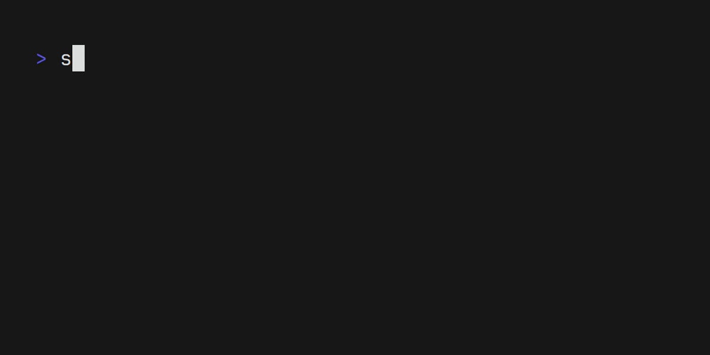

<center>
# Sleuth ID
## Analyze and exploit UUIDv1 🕵️
</center>



## Scenario

Let's say you found a UUIDv1 somewhere : `2c8e6343-2676-11f0-be4a-0242ac100011`

You can use `sleuthid` to analyze it and find out the MAC address and timestamp indicating when and by which machine it was generated.

```bash
$ sleuthid analyze 2c8e6343-2676-11f0-be4a-0242ac100011 | jq "."
{
  "timestamp": "2025-05-01 10:22:24.401081900",
  "mac": "02:42:AC:10:00:11",
  "version": 1,
  "clock_seq": 48714
}
```

Then you can forge a new UUIDv1 containing the same MAC address and clock sequence thanks to the `forge` command.

```bash
sleuthid forge -t "2025-05-01 10:00:24.401081900" 2c8e6343-2676-11f0-be4a-0242ac100011
19c65f43-2673-11f0-be4a-0242ac100011
```

Most systems have a little offset between the clock sequence and the time of the generation of the UUIDv1. Thus exploitation of UUIDv1
might need to iterate over a range of timestamps to find the right one. Thus `sleuthid` provides the `-o <offset` and `-n <nth>` options
to generate `n` timestamps starting from a negative offset.

```bash
$ sleuthid forge -t "2025-05-01 10:00:24.401081900" -o 2 -n 5 2c8e6343-2676-11f0-be4a-0242ac100011
19c65f41-2673-11f0-be4a-0242ac100011
19c65f42-2673-11f0-be4a-0242ac100011
19c65f43-2673-11f0-be4a-0242ac100011
19c65f44-2673-11f0-be4a-0242ac100011
19c65f45-2673-11f0-be4a-0242ac100011
```

## Installation

```
cargo install sleuthid
```
